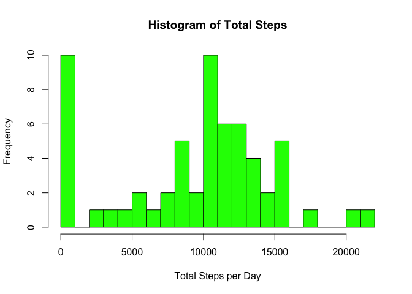
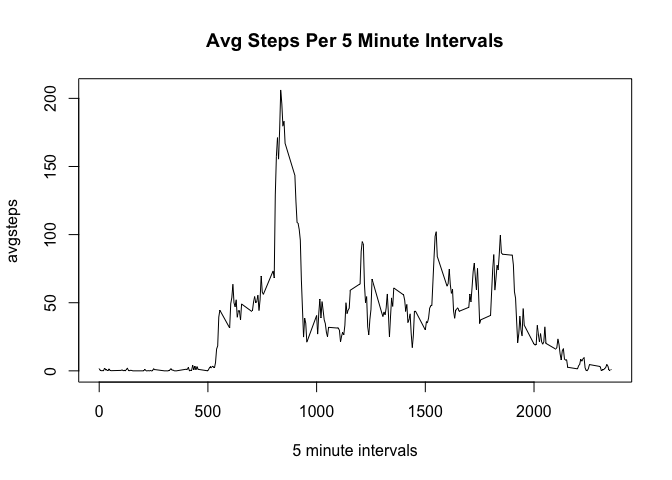
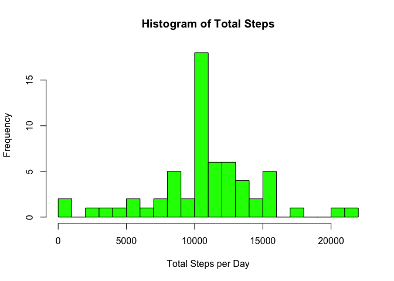
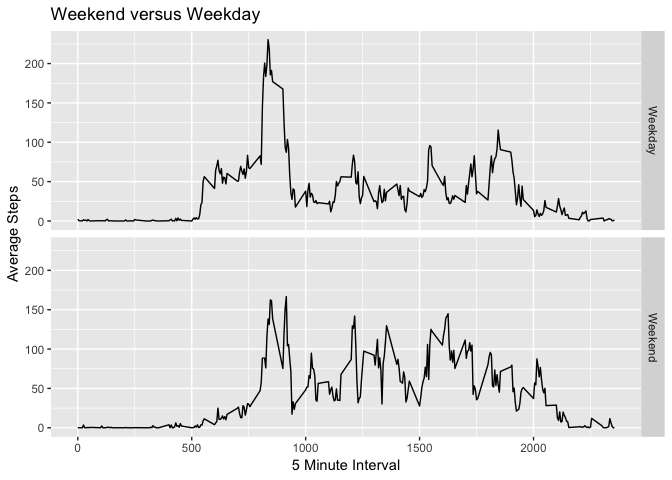

Reproduciple Research Project 1
===============================


###Loading and preprocessing the data
####1. Load the data

```r
# Read in the data (download, unzip and read) 
url <- "https://d396qusza40orc.cloudfront.net/repdata%2Fdata%2Factivity.zip"
download.file(url, destfile="./activity.zip", method="curl") 
zip <- "./activity.zip"
outdir <- "./activity"
unzip(zip, exdir = outdir)
activity <- read.csv("./activity/activity.csv")
```
####2. Process/transform the data (if necessary) into a format suitable for your analysis

```r
#adjust display of printed numbers
options(scipen = 1, digits = 2)

#change date variable to date class
activity$date <- as.Date(activity$date)
```

###What is mean total number of steps taken per day?
####1. Calculate the total number of steps taken per day
We'll need to ignore missing values for the first part of this project. There are
two ways we can remove the NAs, each giving a different initial result for the mean and median, due to the fact that 8 days have all NA values at every interval. The first option is to remove the NAs when we sum up the total steps taken by day. When we do this, the total steps is divided by 61 days. 

The second option is to keep NAs as we calculate the sum and remove NAs during the calculation of the mean and median. These functions do not include the 8 days with missing data, thus the total steps is divided by 53 days.

I chose option 1, as it is possible when exploring data that some variables will have partial information. I choose to included all days in calculating the mean and median, regrdless of if they were complete cases or not.

Summary of total number of steps taken per day:

```r
library(dplyr)
```

```
## 
## Attaching package: 'dplyr'
```

```
## The following objects are masked from 'package:stats':
## 
##     filter, lag
```

```
## The following objects are masked from 'package:base':
## 
##     intersect, setdiff, setequal, union
```

```r
activity <- group_by(activity, date)
totalsteps <- summarise(activity, sum(steps, na.rm = TRUE))
names(totalsteps) <- c("day", "total.steps")
totalsteps
```

```
## # A tibble: 61 x 2
##    day        total.steps
##    <date>           <int>
##  1 2012-10-01           0
##  2 2012-10-02         126
##  3 2012-10-03       11352
##  4 2012-10-04       12116
##  5 2012-10-05       13294
##  6 2012-10-06       15420
##  7 2012-10-07       11015
##  8 2012-10-08           0
##  9 2012-10-09       12811
## 10 2012-10-10        9900
## # … with 51 more rows
```

####2. Make a histogram of the total number of steps taken each day

```r
hist(totalsteps$total.steps, breaks = 16, col = "green", xlab = "Total Steps per Day", main 
     = "Histogram of Total Steps")
```

<!-- -->

####3. Calculate and report the mean and median of the total number of steps taken per day

```r
mean <- mean(totalsteps$total.steps)
median <- median(totalsteps$total.steps)
```
The mean steps per day is 9354.23 and the median steps per day is 10395.


###What is the average daily activity pattern?
####1. Make a time series plot (i.e. type="l") of the 5-minute interval (x-axis) and the average number of steps taken, averaged across all days (y-axis)

On the x-axis is the time interval at each 5 minutes. 0 is at 0 minutes, 2355 is at 23 hours and 55 minutes.

```r
stepsbyinterval<- activity %>% group_by(interval) %>% 
    summarize(avgsteps = mean(steps, na.rm = TRUE))
with(stepsbyinterval, plot(interval, avgsteps, type = "l", xlab = "5 minute intervals", main = "Avg Steps Per 5 Minute Intervals"))
```

<!-- -->


####2. Which 5-minute interval, on average across all the days in the dataset, contains the maximum number of steps?

```r
max <- stepsbyinterval$interval[which(stepsbyinterval$avgsteps==max(stepsbyinterval$avgsteps))]
```

The time interval with the most average setps is 835. 

###Imputing missing values
####1. Calculate and report the total number of missing values in the dataset (i.e. the total number of rows with NAs)

```r
nas <- length(activity$steps[is.na(activity$steps)])
```

The number of missing values in the data set is 2304. 

####2. Devise a strategy for filling in all of the missing values in the dataset. 
For each NA value, we will replace it with the mean number of steps at that interval of time. 

####3. Create a new dataset that is equal to the original dataset but with the missing data filled in.

```r
#create new dataset with the average number of steps of the 5-minute interval over across all the days. 
activity <- mutate(activity, "steps.by.interval" = stepsbyinterval$avgsteps)

#replace NAs
activity$steps[is.na(activity$steps)] <- activity$steps.by.interval
```

```
## Warning in activity$steps[is.na(activity$steps)] <-
## activity$steps.by.interval: number of items to replace is not a multiple of
## replacement length
```

####4. Make a histogram of the total number of steps taken each day and Calculate and report the mean and median total number of steps taken per day. Do these values differ from the estimates from the first part of the assignment? What is the impact of imputing missing data on the estimates of the total daily number of steps?


```r
activity <- group_by(activity, date)
totalsteps <- summarise(activity, sum(steps))
names(totalsteps) <- c("day", "total.steps")
hist(totalsteps$total.steps, breaks = 16, col = "green", xlab = "Total Steps per Day", main 
     = "Histogram of Total Steps")
```

<!-- -->


```r
mean2 <- mean(totalsteps$total.steps)
median2 <- median(totalsteps$total.steps)
```

Our new mean is 10766.19 and our new median is 10766.19. We can see an increase in both, which makes sense due to the way I chose to remove NAs. 


##Are there differences in activity patterns between weekdays and weekends?
####1. Create a new factor variable in the dataset with two levels – “weekday” and “weekend” indicating whether a given date is a weekday or weekend day.

```r
#add a "day.of.week" variable to data set
activity <- mutate(activity, "day.of.week" = weekdays(date))

#add variable day to indicate Weekend or Weekday
activity$day <- ifelse(activity$day.of.week == "Saturday" | 
                  activity$day.of.week == "Sunday", "Weekend", "Weekday")

#group by interval and day variable and get average steps per interval
stepsbyinterval <- activity %>% group_by(interval, day) %>% 
    summarize(avgsteps = mean(steps))
```
####2. Make a panel plot containing a time series plot (i.e.type="l") of the 5-minute interval (x-axis) and the average number of steps taken, averaged across all weekday days or weekend days (y-axis). 

```r
library(ggplot2)
```

```
## Use suppressPackageStartupMessages() to eliminate package startup
## messages.
```

```r
#plot data by weekday or weekend factor
qplot(interval, avgsteps, data = stepsbyinterval, geom = "line")+ 
    facet_grid(day~.) +
    ggtitle("Weekend versus Weekday")+
    xlab("5 Minute Interval")+
    ylab("Average Steps")
```

<!-- -->

